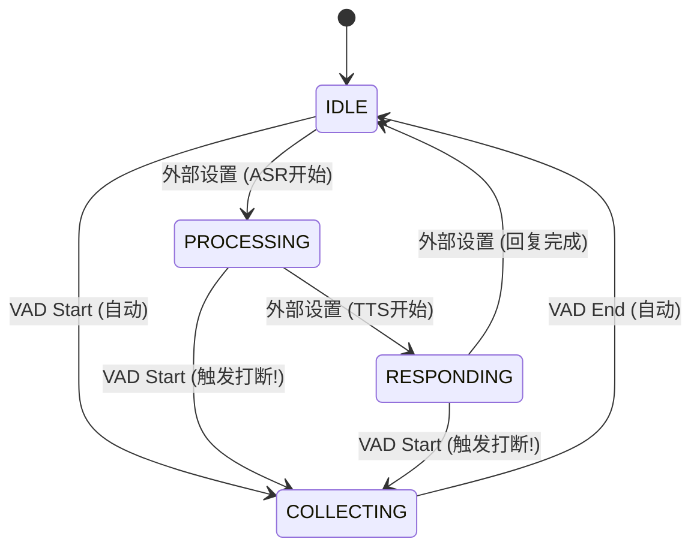

# VAD打断检测功能 - 实施总结

## 1. 核心目标
实现基于VAD（语音活动检测）的实时打断功能，使用户在系统处于处理（Processing）或回复（Responding）状态时，能通过说话立即打断系统，实现自然的对话交互。

## 2. 架构改动

### 2.1 数据结构扩展 (`cascade/stream/types.py`)
- **SystemState**: 新增系统状态枚举。
  - `IDLE`: 空闲
  - `COLLECTING`: 正在聆听（用户说话）
  - `PROCESSING`: 正在思考（ASR/LLM处理中）
  - `RESPONDING`: 正在回复（TTS播放中）
- **InterruptionConfig**: 打断配置（启用开关、最小间隔）。
- **InterruptionEvent**: 打断事件结构（包含时间戳、被打断的状态、置信度）。
- **CascadeResult**: 扩展支持 `interruption` 类型。

### 2.2 核心逻辑 (`cascade/stream/interruption_manager.py`)
- **职责**: 维护系统状态，判断是否触发打断。
- **设计优化**: 
  - **移除冷却期**: 废弃了复杂的计时器逻辑，直接依赖状态机作为天然互斥锁，消除了状态不同步（僵尸状态）的隐患。
  - **状态卫兵**: 在 `set_state` 中增加检查，严禁在 `COLLECTING`（用户说话时）被外部强制切换状态，防止状态劫持。

### 2.3 状态机集成 (`cascade/stream/state_machine.py`)
- **双向同步**: 
  - **入口卫兵**: VAD检测到语音时，必须获得 Manager 的许可。如果 Manager 拒绝（例如间隔太短），状态机强制忽略该语音，防止物理层与逻辑层分裂。
  - **联动触发**: 确认打断后，立即返回打断事件并自动启动收集器。

### 2.4 处理器接口 (`cascade/stream/processor.py`)
- 集成了 `InterruptionManager`。
- 暴露 `set_system_state(state)` 供外部业务逻辑调用。

## 3. 鲁棒性设计 (Robustness)

为确保高可用性，实施了以下**双向卫兵机制**：

1.  **入口卫兵 (Gatekeeper)**: 防止 VAD 层面的状态分裂。
    - *位置*: `VADStateMachine.process_frame`
    - *逻辑*: VAD Start -> Manager Check -> If Reject -> Ignore Frame.

2.  **切换卫兵 (State Lock)**: 防止外部业务逻辑的状态劫持。
    - *位置*: `InterruptionManager.set_state`
    - *逻辑*: External Set State -> If Current is COLLECTING -> Reject Change.

## 4. 状态流转图

